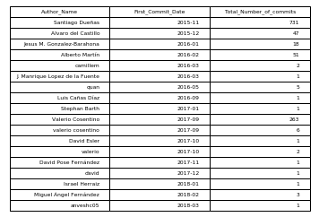
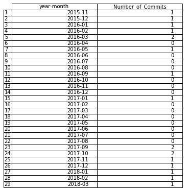

# Chaoss-Microtasks

## MicroTask1 
#### Produce a listing of the number of new committers per month, and the number of commits for each of them, as a table and as a CSV file. Use the GrimoireLab enriched index for git.

**Solution** :- The code is in the [MicroTask-1](https://github.com/gopal86/Chaoss-Microtasks/tree/master/MicroTask-1) directory . It contains CSV, JGP files of the output as well.

**Data Retrival** :- Data retirval can be done by two ways . Both the codes are in the [MicroTask-1](https://github.com/gopal86/Chaoss-Microtasks/tree/master/MicroTask-1) directory.

1.) By `p2o.py` uploading the data to ElasticSearch . and then using the ElasticSearch API's to access the data in the indices . The `p2o.py ` can be run through terminal or in the code itself ( through `subprocess Library`)

2.) By creating indices through ElasticSearch and uploading it through the code.

### Output

#### Total Commits by all Authors

#### New Commiters each month

## MicroTask2 
#### Produce a chart showing the distribution of time-to-close (using the corresponding field in the GrimoireLab enriched index for GitHub issues) for issues already closed, and opened during the last six months.

## MicroTask3
#### Produce a listing of repositories, as a table and as CSV file, with the number of commits authored, issues opened, and pull requests opened, during the last three months, ordered by the total number (commits plus issues plus pull requests).

### Note 
- Make sure you have your LocalHost instance () **_ON_** .
- Install all the necessary dependencies . Check this [Link](https://grimoirelab.gitbooks.io/tutorial/before-you-start/supporting-systems.html) for further instruction for installation.
